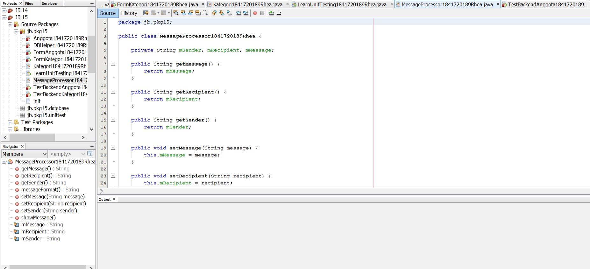
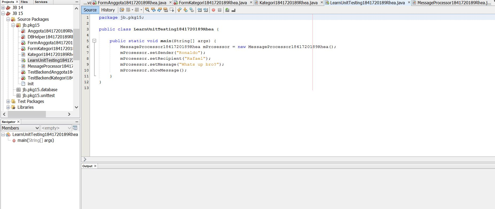
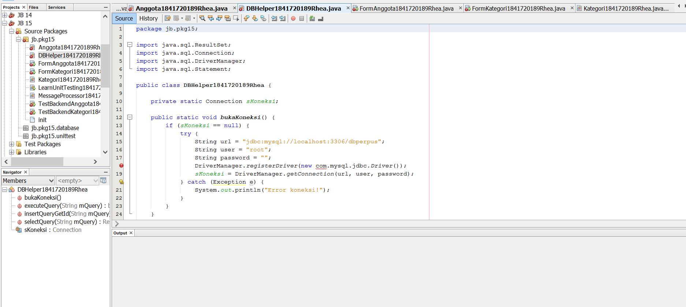
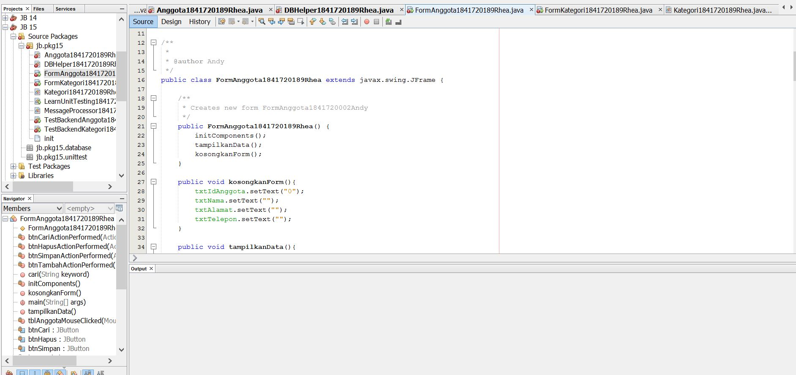
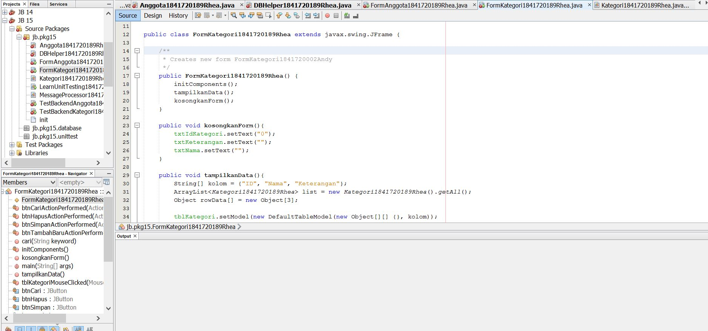
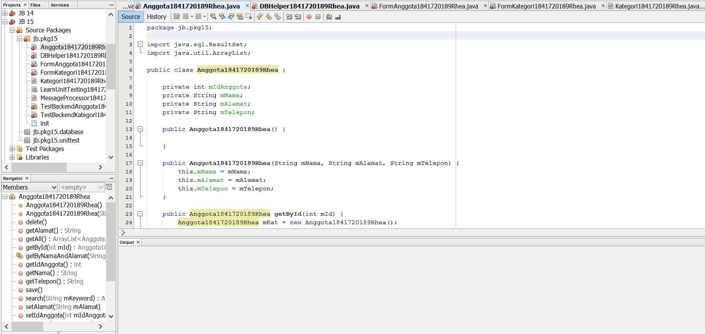
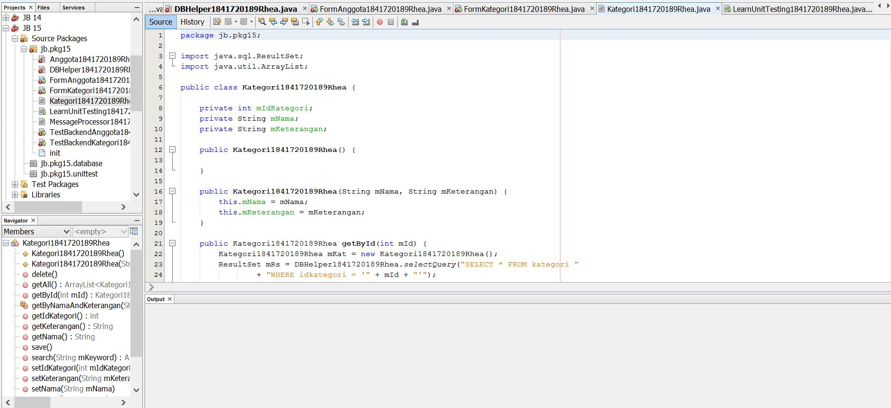

# Laporan Praktikum #15 - Unit Testing
## Kompetensi

 Setelah menyelesaikan lembar kerja ini mahasiswa diharapkan mampu:
1. Memahami konsep dan fungsi unit testing
2. Menerapkan unit testing dengan JUnit pada program sederhana.
3. Menerapkan unit testing dengan JUnit pada progam yang terkoneksi database

## Ringkasan Materi

Dari percobaan diatas, kita akan membuat sebuah program sederhana
yang mengilustrasikan sebuah aplikasi pengiriman pesan
yang nantinya akan dibuatkan unit test-nya.

## Percobaan

### Percobaan 1

Pada percobaan yang pertama ini kita akan membuat sebuah program sederhana
yang mengilustrasikan sebuah aplikasi pengiriman pesan. Pada program tersebut
terdapat satu class utama dimana didalamnya terdapat beberapa method sederhana
yang nantinya akan dibuatkan unit test-nya.
1. Buatlah sebuah project baru di NetBeans dengan nama LearnUnitTesting. Pada
package unittest, di tempat yang sama dengan class mainnya, buatlah 1 file class
baru bernama MessageProcessor.java.
2. Bukalah file MessageProcessor.java, ketikkan baris-baris kode berikut yang
terdiri dari beberapa properties. Setelah itu generate-lah setter untuk semua
variabel-nya.
3. Berikutnya, tambahkan 3 method berikut pada class MessageProcessor, pastikan
semua access modifier-nya public.
Ketiga method yang dibuat ini adalah method yang sangat sederhana dan semua
kegunaannya sesuai dengan nama methodnya. Method messageFormat(), hanya
menambahkan beberapa kata pembuka yang berisi variabel sender dan
recipient di awal dan message kemudian mengembalikannya sebagai sebuah
String.
4. Berikutnya bukalah file class LearnUnitTesting.java yang telah dibuat pada
langkah ke-1. Pada class tersebut tambahkan kode untuk menjalankan class
MessageProcessor seperti berikut.
5. Eksekusi program seperti biasa lewat NetBeans untuk melihat jalannya program
MessageProcessor yang telah Anda buat.
6. Sampai disini, aplikasi telah selesai dibuat. Berikutnya akan kita buat pengetesan
unit sederhana untuk program kita tersebut. Untuk melakukannya, pertama kali
buatlah sebuah package bernama unittesting (sama dengan nama package
project), di folder Test Packages. Pada package tersebut, tambahkan 2 buah file
class bernama MessageProcessorTest.java dan TestRunner.java. Perhatikan
penamaan class testing disini! Untuk menamai class untuk pengetesan maka
konvensinya adalah NamaClass + Test = NamaClassTest.
7. Pertama-tama bukalah terlebih dahulu file class MessageProcessorTest.java
pada class tersebut tambahkan baris-baris kode berikut.
Pada class ini terdapat objek dari class MessageProcessor dengan nama
mProcessor, dimana variabel tersebut nantinya menjadi subjek uji dari class
MessageProcessorTest. Data-data dari objek uji tersebut diisi manual pada
konstruktor class test. Pada konstruktor tersebut diisi data-data yang diketahui
agar dapat dibandingkan dengan data yang dihasilkan pada saat tes dijalankan.
8. Berikutnya tambahkan kode berikut pada method uji testShowMessage(). Kode
pada method tersebut alurnya hampir sama dengan method pada langkah
sebelumnya yaitu membandingkan ‘hasil yang diharapkan’, yang diisi manual
berdasarkan nilai properti pesan dari objek mProcessor yang diisikan pada
konstruktor, dengan hasil aktual dari method messageFormat() pada objek
tersebut.
9. Kemudian bukalah file class TestRunner.java yang telah dibuat sebelumya, lalu
isikan didalamnya baris-baris kode berikut.
Class ini adalah class Main dari Test Packages, class ini yang nantinya dieksekusi
ketika akan menjalankan tes secara keseluruhan. Pada class tersebut dilakukan
eksekusi class MessageProcessorTest, dimana hasilnya kemudian akan diambil
informasi mengenai unit-unit tes yang gagal dan kemudian ditampilkan pesan
gagalnya karena apa.
10. Klik kanan pada file class tersebut lalu pilih Run. Maka pada output window akan
dapat dilihat hasil seperti berikut.
11. Hasil unit testing juga dapat dilihat melalui Test Results Window jika kita
menjalankan unit testing lewat menu Run  Test Project (Nama Project). Pada
window ini akan ditampilkan bar warna hijau jika semua tes berhasil dijalankan,
dan akan menampilkan warna merah jika sebaliknya. Disamping bar juga
ditampilkan pesan-pesan yang kita kirim lewat System.out.println().

### Percobaan 2
Pada percobaan kedua kita akan mencoba membuat test case dari salah satu
percobaan pada jobsheet minggu ke 14. Struktur file dari percobaan ke satu terdiri
dari 4 file class yaitu DBHelper.java, FormKategori.java, Kategori.java dan
TestBackend.java.
Hasil akhir dari percobaan satu jobsheet ke 14 adalah seperti pada gambar berikut.
Aplikasi dapat melakukan insert, update, select dan delete ke database dbperpus
tabel kategori.
1. Bukalah project yang telah Anda buat pastikan dapat berjalan. Setelah project
tersebut dapat dijalankan, bukalah folder Test Packages pada project explorer.
Kemudian buat package dengan nama database, pilih New  Other…
2. Selanjutnya pilih Test for Existing Class.
3. Di jendela dialog yang muncul berikutnya, klik Browse… lalu pilih class
Kategori.java, karena class ini lah yang akan kita buatkan unit testnya. Di
jendela dialog yang muncul berikutnya klik Finish.
4. Setelah selesai langkah sebelumnya, perhatikan di folder Test Packages, sudah
dibuatkan secara otomatis sebuah class test bernama KategoriTest. Bukalah classPada bagian atas class terdapat beberapa baris kode yang terdiri dari konstruktor,
static setUpClass(), static tearDownClass(), setup(), dan tearDown(). Masing
masing method tersebut diatasnya terdapat anotasi yang berbeda-beda. Maksud
dari masing-masing anotasi tersebut adalah bahwa pada saat tes dijalankan maka
method dengan anotasi @BeforeClass akan dijalankan sekali pada saat awal
pertama kali class test akan dijalankan. @AfterClass dijalankan sekali pada saat
seluruh class test dijalankan. @Before dijalankan setiap kali masing-masing
method test akan dijalankan, dan sebaliknya @After dijalankan setiap kali
masing-masing method test selesai dijalankan.
5. Selain itu jika Anda perhatikan di bagian bawah class yang sama, terdapat
beberapa method yang sesuai dengan yang ada pada class Kategori. Bukalah
class Kategori tersebut, perhatikan disana terdapat method testGetIdkategori(),
testSetIdkategori(), testSearch(), testSave(), dan testDelete(). Expand-lah semua
method-method yang otomatis dibuatkan tersebut, lalu hapus method get test, set test,
dan sisakan method testSave dan testSearch . Seperti pada screenshoot di bawah ini!
6. Selanjutnya, kita buat class KategoriTest tersebut menjadi turunan dari class
milik JUnit yaitu class TestCase.
Dengan meng-extends class TestCase tersebut kita dapat dengan mudah
memperoleh informasi tentang test yang saat ini sedang dijalankan. Contoh dari
informasi-informasi ini salah satunya yang terpenting adalah tentang namamethod unit test yang sedang dijalankan, cukup dipanggil dengan syntax:
this.getName().
7. Selanjutnya tambahkan beberapa properties pada class KategoriTest yang kita
buat sebagaimana ditunjukkan pada kode yang di-highlight pada gambar di
bawah.
8. Lalu pada method setUp() dan teardown(), tambahkan baris-baris kode berikut:
Pada method setUp() ini kita mempersiapkan segala sesuatu yang dibutuhkan
untuk semua method test pada class KategoriTest. Diantaranya adalah mengisi
variabel secara manual sehingga kita bisa memprediksi hasil eksekusi method
insert dan search.
9. Selanjutnya adalah salah satu yang terpenting yaitu menulis kode untuk
mengetes method testSave() dan testSearch()!
Karena save atau insert ke database tidak memiliki return type maka salah satu cara yang
valid untuk melihat insert ke database sukses atau tidak adalah dengan membuat query
untuk me-select bedasarkan nama dan keterangan yang diinsert. Maka tambahkan
method getByNamaDanKeterangan(), di Kategori.java
10. Run class Kategori.java bagaimana hasilnya?
11. Edit file bernama TestRunner pada percobaan sebelumnya menjadi seperti
berikut.
Kode-kode pada class ini hampir sama dengan kode class TestRunner yang ada
pada percobaan sebelmnya. Bedanya hanya terletak pada class yang akan diuji
di parameter method JUnitCore.runClasses() saja. Jika test Runner di run
hasilnya adalah sebagai berikut:

Contoh link kode program : [ini contoh link ke kode program](../../src/15_Unit_Testing_/MessageProcessor1841720189Rhea.java)

Contoh link kode program : [ini contoh link ke kode program](../../src/15_Unit_Testing_/LearnUnitTesting1841720189Rhea.java)

## Tugas
Tugas:
1. Buat test case untuk percobaan kedua pada jobsheet ke 14

Contoh link kode program : [ini contoh link ke kode program](../../src/15_Unit_Testing_/DBHelper1841720189Rhea.java)

Contoh link kode program : [ini contoh link ke kode program](../../src/15_Unit_Testing_/Anggota1841720189Rhea.java)

Contoh link kode program : [ini contoh link ke kode program](../../src/15_Unit_Testing_/Kategori1841720189Rhea.java)

Contoh link kode program : [ini contoh link ke kode program](../../src/15_Unit_Testing_/FormAnggota1841720189Rhea.java)

Contoh link kode program : [ini contoh link ke kode program](../../src/15_Unit_Testing_/FormKategori1841720189Rhea.java)

Contoh link kode program : [ini contoh link ke kode program](../../src/15_Unit_Testing_/TestBackendAnggotao1841720189Rhea.java)

Contoh link kode program : [ini contoh link ke kode program](../../src/15_Unit_Testing_/TestBackendKategori1841720189Rhea.java)

## Kesimpulan

Dari percobaan diatas, kita telah membuat sebuah program sederhana
yang mengilustrasikan sebuah aplikasi pengiriman pesan. Pada program tersebut
terdapat satu class utama dimana didalamnya terdapat beberapa method sederhana
yang nantinya akan dibuatkan unit test-nya. 

## Pernyataan Diri

Saya menyatakan isi tugas, kode program, dan laporan praktikum ini dibuat oleh saya sendiri. Saya tidak melakukan plagiasi, kecurangan, menyalin/menggandakan milik orang lain.

Jika saya melakukan plagiasi, kecurangan, atau melanggar hak kekayaan intelektual, saya siap untuk mendapat sanksi atau hukuman sesuai peraturan perundang-undangan yang berlaku.

Ttd,

***Ivanarhea Edagavrila Clareta***
