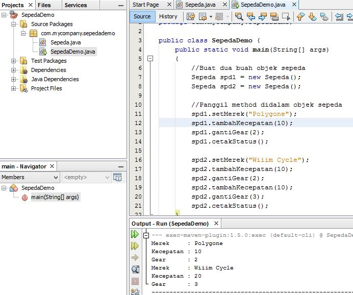

# Laporan Praktikum #1 - Pengantar Konsep PBO

## Kompetensi

Setelah menempuh materi percobaan ini, mahasiswa mampu mengenal: 
1. Perbedaan paradigma berorientasi objek dengan paradigma struktural 
2. Konsep dasar PBO

## Ringkasan Materi

Selama saya mengerjakan, cukup rumit:(

## Percobaan

### Percobaan 1

Didalam percobaan ini, kita akan mendemonstrasikan bagaimana membuat class, membuat object, kemudian mengakses method didalam class tersebut.

[source code class sepeda](../../src/1_Pengantar_Konsep_PBO/1.java)

[source code main sepeda](../../src/1_Pengantar_Konsep_PBO/1.2.java)

### Percobaan 2

Didalam percobaan ini, akan didemonstrasikan salah satu fitur yang paling penting dalam PBO, yaitu inheritance. Disini kita akan membuat class SepedaGunung yang mana adalah turunan/warisan dari class Sepeda. Pada dasarnya class SepedaGunung adalah sama dengan class Sepeda, hanya saja pada sepeda gunung terdapat tipe suspensi. Untuk itu kita tidak perlu membuat class Sepeda Gunung dari nol, tapi kita wariskan saja class Sepeda ke class SepedaGunung.

[source code class sepedaGunung](../../src/1_Pengantar_Konsep_PBO/2.java)

[source code main sepedaGunung](../../src/1_Pengantar_Konsep_PBO/2.2.java)

## Pertanyaan

1.	Sebutkan dan jelaskan aspek-aspek yang ada pada pemrograman berorientasi objek! 
Jawab : 
•	Object 
Object adalah suatu rangkaian dalam program yang terdiri dari state dan behaviour. Object pada software dimodelkan sedemikian rupa sehingga mirip dengan objek yang ada di dunia nyata. Objek memiliki state dan behaviour. State adalah ciri-ciri atau atribut dari objek tersebut.
•	Class 
Class adalah blueprint atau prototype dari objek.
•	Enkapsulasi
Disebut juga dengan information-hiding. Dalam berinteraksi dengan objek, seringkali kita tidak perlu mengetahui kompleksitas yang ada didalamnya.
•	Inheritance
Disebut juga pewarisan. Inheritance memungkinkan kita untuk mengorganisir struktur program dengan natural. Inheritance juga memungkinkan kita untuk memperluas fungsionalitas program tanpa harus mengubah banyak bagian program.
•	Polimorfisme 
Polimorfisme juga meniru sifat objek di dunia nyata, dimana sebuah objek dapat memiliki bentuk, atau menjelma menjadi bentuk-bentuk lain.

2.	Apa yang dimaksud dengan object dan apa bedanya dengan class? 
Jawab : 
Object yaitu Object adalah suatu rangkaian dalam program yang terdiri dari state dan behavior,sedangkan class adalah blueprint atau prototype dari objek. Ambil contoh objek sepeda. Terdapat berbagai macam sepeda di dunia, dari berbagai merk dan model

3.	Sebutkan salah satu kelebihan utama dari pemrograman berorientasi objek dibandingkan dengan pemrograman struktural!
Jawab : 
Kelebihan PBO adalah program dapat lebih fleksibel dan modular, jika ada perubahan fitur, maka dapat dipastikan keseluruhan program tidak akan terganggu. Berbeda dengan struktural, perubahan sedikit fitur saja kemungkinan dapat mengganggu keseluruhan program.  

4.	Pada class Sepeda, terdapat state/atribut apa saja?
Jawab : 
Kecepatan,gear,merek

5.	Tambahkan atribut warna pada class Sepeda. 
Jawab : 

## Tugas

[source code class Bangun](../../src/1_Pengantar_Konsep_PBO/bangun.java)

[source code class Luas](../../src/1_Pengantar_Konsep_PBO/luas.java)

[source code main Main](../../src/1_Pengantar_Konsep_PBO/main.java)

## Kesimpulan

Dari percobaan diatas, kita telah mendemonstrasikan bagaimana paradigma pemrograman berorientasi objek dan mengimplementasikannya kedalam program sederhana. Kita juga telah mendemonstrasikan salah satu fitur paling penting dari PBO yaitu inheritance, yaitu dalam hal membuat class SepedaGunung.  
Kita ketahui bahwa SepedaGunung pada dasarnya adalah sama dengan Sepeda (memiliki gear, memiliki kecepatan, dapat menambah kecepatan, dapat mengerem, pindah gigi, dsb) namun ada fitur tambahan yaitu tipe suspensi. Maka kita tidak perlu membuat class SepedaGunung dari nol, kita extends atau wariskan saja dari class Sepeda, kemudian kita tinggal tambahkan fitur yang sebelumnya belum ada di class Sepeda. Inilah salah satu kelebihan PBO yang tidak ada di pemrograman struktural. 

## Pernyataan Diri

Saya menyatakan isi tugas, kode program, dan laporan praktikum ini dibuat oleh saya sendiri. Saya tidak melakukan plagiasi, kecurangan, menyalin/menggandakan milik orang lain.

Jika saya melakukan plagiasi, kecurangan, atau melanggar hak kekayaan intelektual, saya siap untuk mendapat sanksi atau hukuman sesuai peraturan perundang-undangan yang berlaku.

Ttd,

***(Ivanarhea Endagavrila Clareta)***
