<<<<<<< HEAD
# Laporan Praktikum #4 - Relasi Class

## Kompetensi

Setelah menempuh pokok bahasan ini, mahasiswa mampu: 
1. Memahami konsep relasi kelas
2. Mengimplementasikan relasi has‑a dalam program. 

## Ringkasan Materi

Relasi dalam class dinyatakan dalam one‑to‑one. Tetapi ada kalanya relasi class melibatkan lebih dari satu. Hal ini disebut dengan multiplicity. 

## Percobaan

### Percobaan 1

Terdapat class Laptop yang memiliki atribut berupa merk dan prosesor. Jika diperhatikan lebih rinci, maka atribut prosesor sendiri didalamnya memiliki data berupa merk, nilai cache memori, dan nilai clock‑nya. Artinya, ada class lain yang namanya Processor yang memiliki atribut merk, cache dan clock, dan atribut prosesor yang ada di dalam class Laptop itu merupakan objek dari class Proceessor tersebut. Sehingga terlihat antara class Laptop dan class Processor memiliki relasi (has‑a).

- Class Laptop1841720189Rhea.java

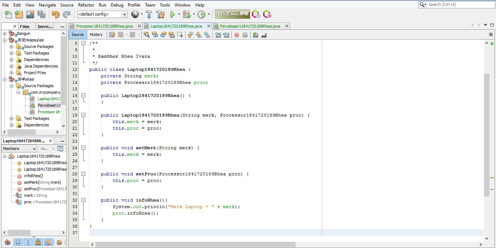

Link kode program : [Laptop1841720189Rhea.java](../../src/4_Relasi_Class/Laptop1841720189Rhea.java)

- Class Processor1841720189Rhea.java

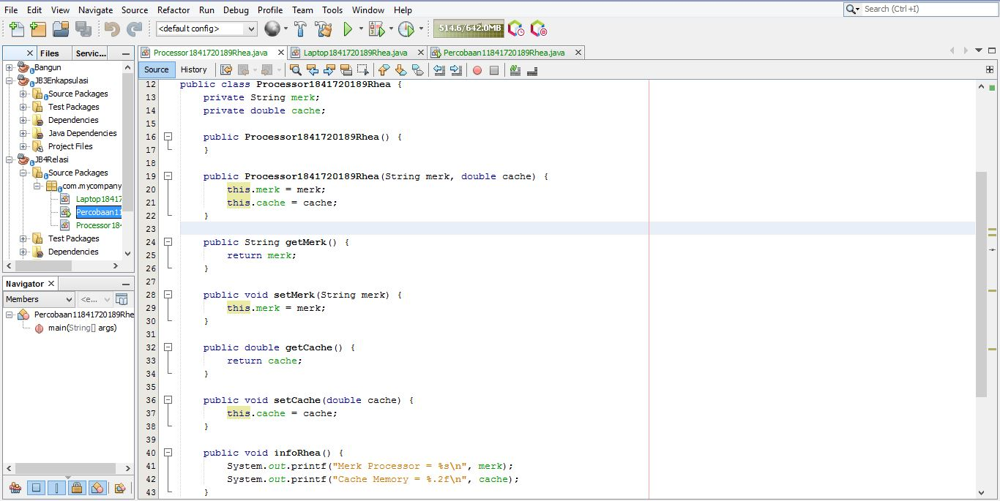

Link kode program :

Link kode program : [Processor1841720189Rhea.java](../../src/4_Relasi_Class/Processor1841720189Rhea.java)

- Class Main, Mainpercobaan11841720189Rhea

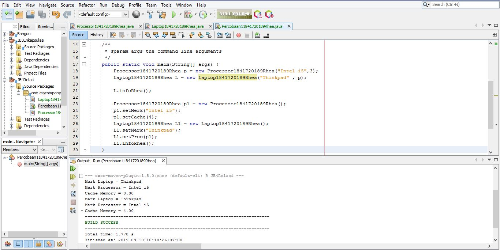

Link kode program : [Percobaan11841720189Rhea.java](../../src/4_Relasi_Class/Percobaan11841720189Rhea.java)

## Pertanyaan Percobaan 1
Berdasarkan percobaan 1, jawablah pertanyaan‑pertanyaan yang terkait: 
1. Di dalam class Processor dan class Laptop , terdapat method setter dan getter untuk masing‑masing atributnya. Apakah gunanya method setter dan getter tersebut ? 
    - Method setter untuk mengeset nilai dari class sedangkan method getter untuk mendapatkan nilai dari atribut class

2. Di dalam class Processor dan class Laptop, masing‑masing terdapat konstruktor default dan konstruktor berparameter. Bagaimanakah beda penggunaan dari kedua jenis konstruktor tersebut ?
    - Perbedaan dari kedua konstruktur tersebut adalah salah satu nya memiliki parameter dan mengeset nilai atribut pada saat instansiasi, sedangkan yg satunya merupakan konstruktor default 
3. Perhatikan class Laptop, di antara 2 atribut yang dimiliki (merk dan proc), atribut manakah yang bertipe object ?

    - Atribut proc 

4. Perhatikan class Laptop, pada baris manakah yang menunjukan bahwa class Laptop memiliki relasi dengan class Processor ?
    - private processor1841720189Rheaproc;
5. Perhatikan pada class Laptop , Apakah guna dari sintaks proc.info() ? 
    - untuk mengetahui data merk dan chache di class Processor agar bisa saling ber relasi antara class laptop dan processor

6. Pada class MainPercobaan1, terdapat baris kode: 

    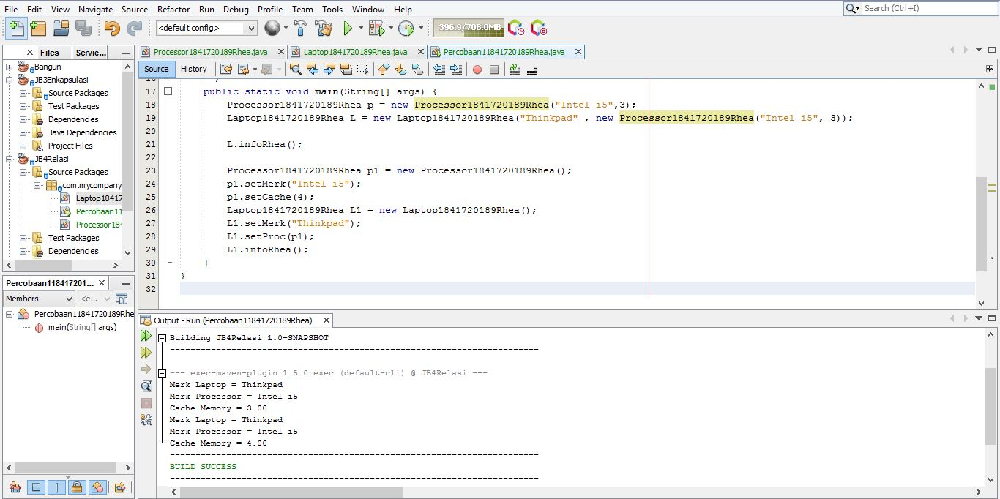

    Link kode program : [pertanyaan6.java](../../src/4_Relasi_Class/pertanyaan6.java)

### Percobaan 2

Diagram class berikut yang menggambarkan sistem rental mobil. Pelanggan bisa menyewa mobil sekaligus sopir. Biaya sopir dan biaya sewa mobil dihitung per hari. 

- Class Sopir1841720189Rhea.java

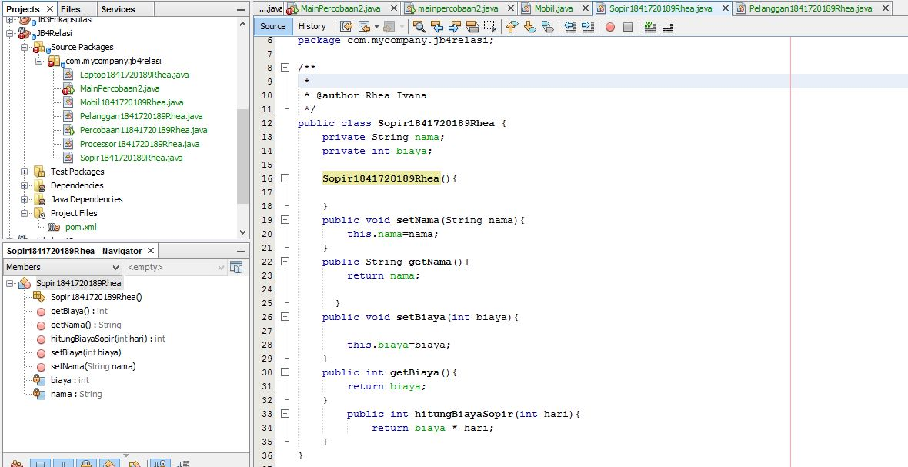

Link kode program : [Sopir.java](../../src/4_Relasi_Class/Sopir1841720189Rhea.java)

- Class Pelanggan1841720189Rhea.java

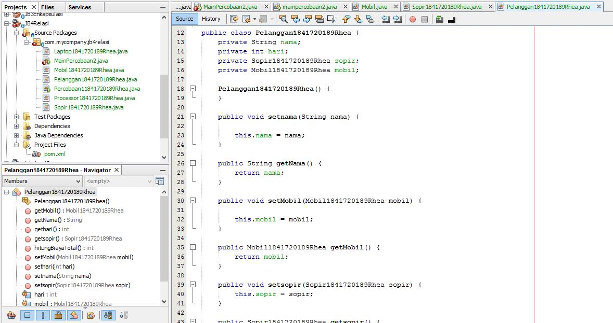

[pelanggan.java](../../src/4_Relasi_Class/Pelanggan1841720189Rhea.java)

- Class Mobil1841720189Rhea .java

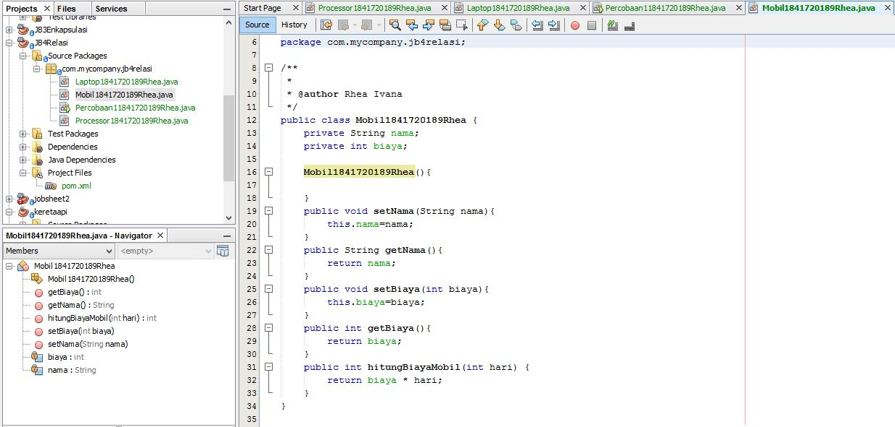

[Mobil.java](../../src/4_Relasi_Class/Mobil1841720189Rhea.java)

- Class Main, MainPercobaan2 

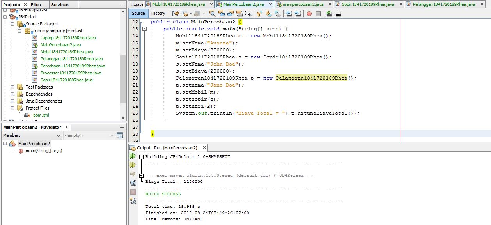

[MainPercobaan2.java](../../src/4_Relasi_Class/MainPercobaan2.java)

## Pertanyaan Percobaan 2

1. Perhatikan class Pelanggan. Pada baris program manakah yang menunjukan bahwa class Pelanggan memiliki relasi dengan class Mobil dan class Sopir ? 

    - private Mobil1841720189Rhea mobil;
    private Sopir sopir;
2. Perhatikan method hitungBiayaSopir pada class Sopir, serta method hitungBiayaMobil pada class Mobil. Mengapa menurut Anda method tersebut harus memiliki argument hari ? 

    - Karena pada method hitungBayarSopirRhea diperlukan sejumlah hari untuk menghitung hasil biaya.

3. Perhatikan kode dari class Pelanggan. Untuk apakah perintah mobil.hitungBiayaMobil(hari) dan sopir.hitungBiayaSopir(hari) ? 

    - Untuk mendapatkan masing-masing biaya sewa mobil dan biaya sewa sopir

4. Perhatikan class MainPercobaan2. Untuk apakah sintaks p.setMobil(m) dan p.setSopir(s) ? 
    
    - Untuk mengeset atribut mobil dan sopir pada objek p(penumpang)

5. Perhatikan class MainPercobaan2. Untuk apakah proses p.hitungBiayaTotal() tersebut ?
    
    - Untuk menghitung biaya total yang didapatkan 
    dari penjumlahan biaya sewa mobil dan biaya sewa sopir

6. Perhatikan class MainPercobaan2, coba tambahkan pada baris terakhir dari method main dan amati perubahan saat di‑run!

### Percobaan 3

-Class KeretaApi1841720189Rhea.java

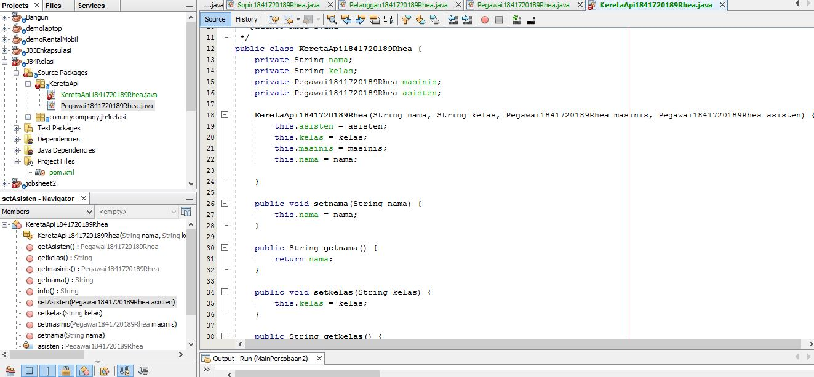

[KeretaApi1841720189Rhea.java](../../src/4_Relasi_Class/KeretaApi1841720189Rhea.java)

-Class pegawai1841720189Rhea.java

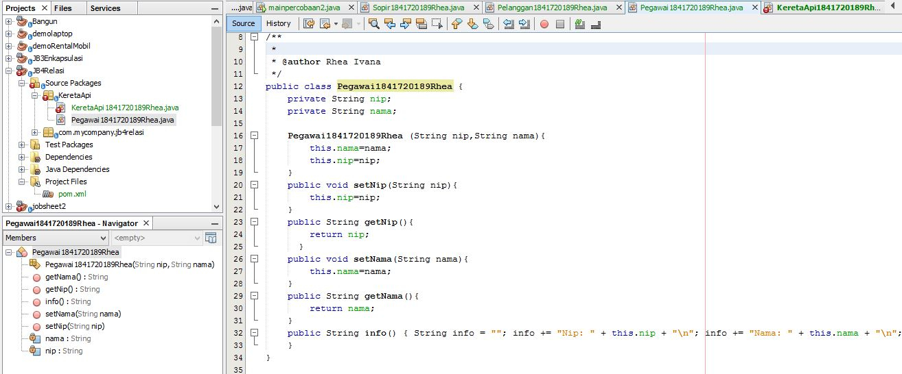

[Pegawai1841720189Rhea.java](../../src/4_Relasi_Class/Pegawai1841720189Rhea.java)

-Class Main, MainPercobaan3

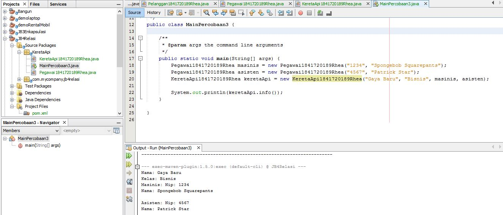

[MainPercobaan3.java](../../src/4_Relasi_Class/MainPercobaan3.java)

### Pertanyaan Percobaan 3

1. Di dalam method info() pada class KeretaApi, baris this.masinis.info() dan this.asisten.info() digunakan untuk apa ? 
    - untuk memanggil method info1841720189Rhea()

2. Buatlah main program baru dengan nama class MainPertanyaan pada package yang sama. Tambahkan kode berikut pada method main() ! 
 
    - Pegawai masinis = new Pegawai("1234", "Spongebob Squarepants"); KeretaApi keretaApi = new KeretaApi("Gaya Baru", "Bisnis", masinis); 
 
 3. Apa hasil output dari main program tersebut ? Mengapa hal tersebut dapat terjadi ? 
 
    [KeretaApi.java](../../src/4_Relasi_Class/KeretaApi1841720189Rhea.java)

 

4. Perbaiki class KeretaApi sehingga program dapat berjalan !

### Percobaan 4

-Class Penumpang1841720189Rhea

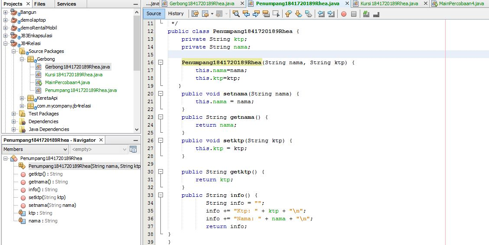

[Penumpang1841720189Rhea.java](../../src/4_Relasi_Class/Penumpang1841720189Rhea.java)

- Class Kursi1841720189Rhea.java

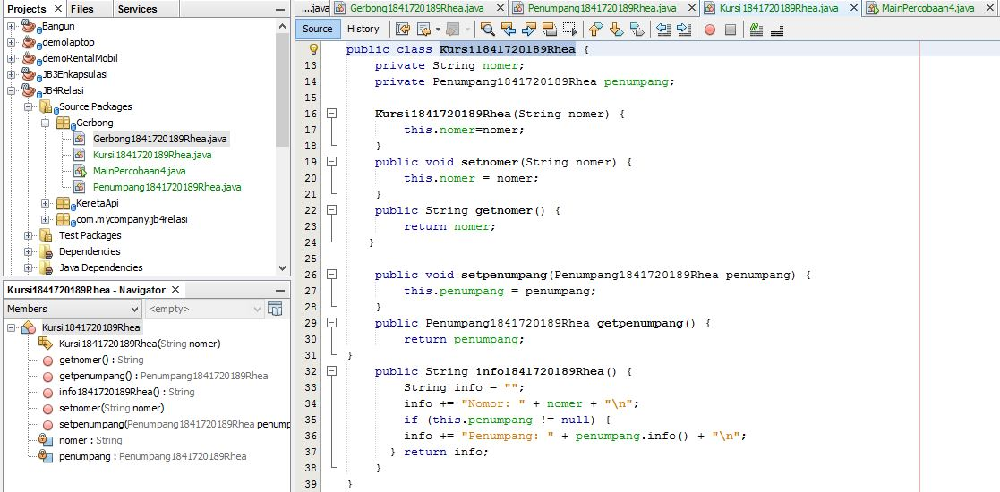

[Kursi.java](../../src/4_Relasi_Class/Kursi1841720189Rhea.java)

- Class Gerbong1841720189Rhea.java

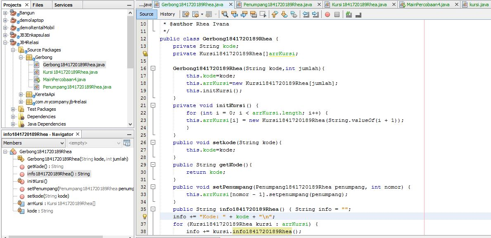

[Gerbong.java](../../src/4_Relasi_Class/Gerbong1841720189Rhea.java)

- Class Main, MainPercobaan4.java

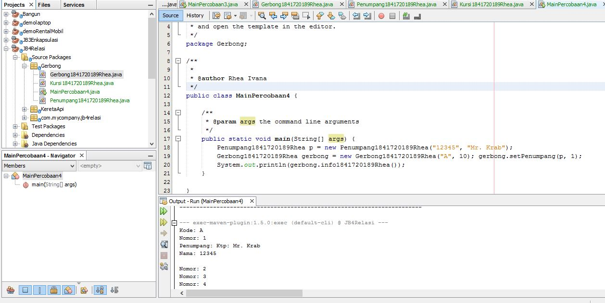

[MainPercobaan4.java](../../src/4_Relasi_Class/MainPercobaan4.java)

### Pertanyaan Percobaan 4

1. Pada main program dalam class MainPercobaan4, berapakah jumlah kursi dalam Gerbong A ? 
    - Jumlah kursi dalam Gerbong A ada 10 kursi 

2. Perhatikan potongan kode pada method info() dalam class Kursi. Apa maksud kode tersebut ? 
 
    f (this.penumpang != null) { info += "Penumpang: " + penumpang.info() + "\n"; } ... 
    -  Maksud dari kode tersebut adalah, jika penumpang tidak kosong maka akan dikeluarkan data pada class Penumpang di method info1841720189Rhea()

3. Mengapa pada method setPenumpang() dalam class Gerbong, nilai nomor dikurangi dengan angka 1 ? 
    - Nilai nomor dikurangi dengan angka 1

4. Instansiasi objek baru budi dengan tipe Penumpang, kemudian masukkan objek baru tersebut pada gerbong dengan gerbong.setPenumpang(budi, 1). Apakah yang terjadi ? 
    - Yang terjadi adalah, data budi tetap keluar akan tetapi menggunakan kursi yang telah digunakan oleh orang lain 

5. Modifikasi program sehingga tidak diperkenankan untuk menduduki kursi yang sudah ada penumpang lain ! 
    -class Main, 
    [MainPercobaan4.java](../../src/4_Relasi_Class/MainPercobaan4.java)

## Tugas

Buatlah sebuah studi kasus, rancang dengan class diagram, kemudian implementasikan ke dalam program! Studi kasus harus mewakili relasi class dari percobaan‑percobaan yang telah dilakukan pada materi ini, setidaknya melibatkan minimal 4 class (class yang berisi main tidak dihitung). 
 
 - Class PS1841720189Rhea.java

 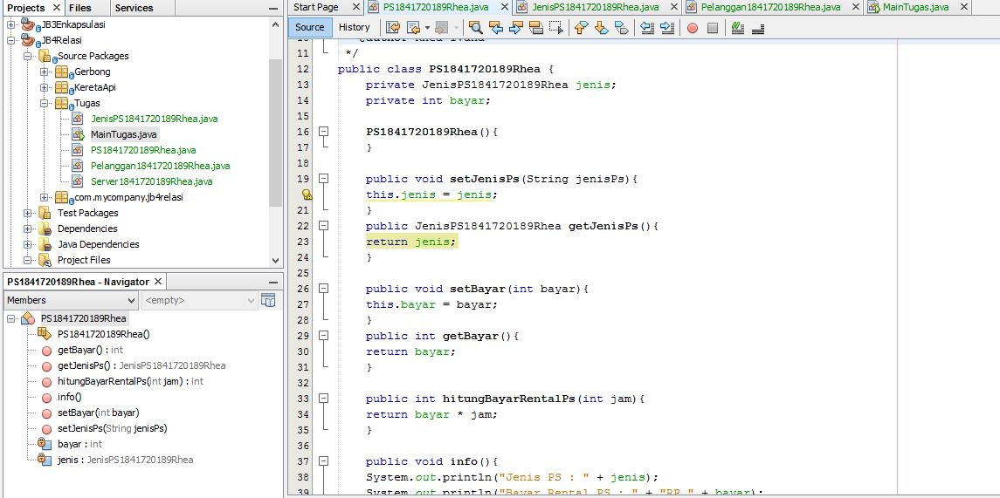

[PS1841720189Rhea.java](../../src/4_Relasi_Class/PS1841720189Rhea.java)

- Class JenisPS1841720189Rhea.java

    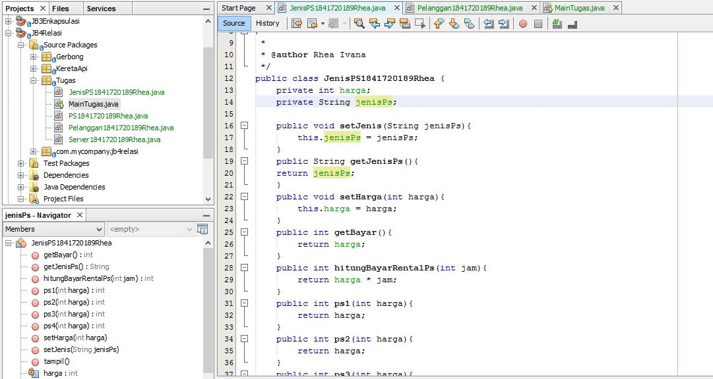

[JenisPS1841720189Rhea.java](../../src/4_Relasi_Class/JenisPS1841720189Rhea.java)

- Class Pelanggan21841720189Rhea.java

    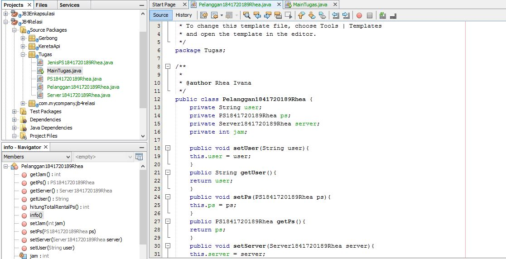

[Pelanggan21841720189Rhea.java](../../src/4_Relasi_Class/Pelanggan21841720189Rhea.java)

- Class Main MainTugas.java

    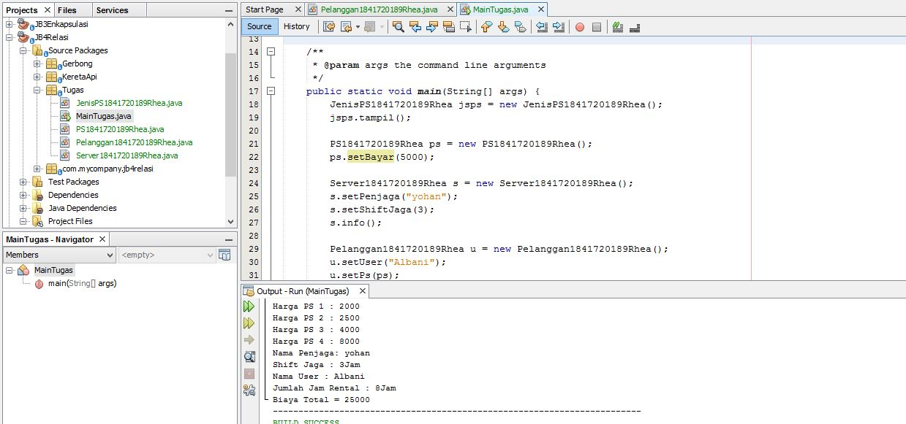

=======
# Laporan Praktikum #4 - Relasi Class

## Kompetensi

Setelah menempuh pokok bahasan ini, mahasiswa mampu: 
1. Memahami konsep relasi kelas
2. Mengimplementasikan relasi has‑a dalam program. 

## Ringkasan Materi

Relasi dalam class dinyatakan dalam one‑to‑one. Tetapi ada kalanya relasi class melibatkan lebih dari satu. Hal ini disebut dengan multiplicity. 

## Percobaan

### Percobaan 1

Terdapat class Laptop yang memiliki atribut berupa merk dan prosesor. Jika diperhatikan lebih rinci, maka atribut prosesor sendiri didalamnya memiliki data berupa merk, nilai cache memori, dan nilai clock‑nya. Artinya, ada class lain yang namanya Processor yang memiliki atribut merk, cache dan clock, dan atribut prosesor yang ada di dalam class Laptop itu merupakan objek dari class Proceessor tersebut. Sehingga terlihat antara class Laptop dan class Processor memiliki relasi (has‑a).

- Class Laptop1841720189Rhea.java

Link kode program : [Laptop1841720189Rhea.java](../../src/4_Relasi_Class/Laptop1841720189Rhea.java)

- Class Processor1841720189Rhea.java

Link kode program :

Link kode program : [Processor1841720189Rhea.java](../../src/4_Relasi_Class/Processor1841720189Rhea.java)

- Class Main, Mainpercobaan11841720189Rhea

Link kode program : [Percobaan11841720189Rhea.java](../../src/4_Relasi_Class/Percobaan11841720189Rhea.java)

## Pertanyaan Percobaan 1
Berdasarkan percobaan 1, jawablah pertanyaan‑pertanyaan yang terkait: 
1. Di dalam class Processor dan class Laptop , terdapat method setter dan getter untuk masing‑masing atributnya. Apakah gunanya method setter dan getter tersebut ? 
    - Method setter untuk mengeset nilai dari class sedangkan method getter untuk mendapatkan nilai dari atribut class

2. Di dalam class Processor dan class Laptop, masing‑masing terdapat konstruktor default dan konstruktor berparameter. Bagaimanakah beda penggunaan dari kedua jenis konstruktor tersebut ?
    - Perbedaan dari kedua konstruktur tersebut adalah salah satu nya memiliki parameter dan mengeset nilai atribut pada saat instansiasi, sedangkan yg satunya merupakan konstruktor default 
3. Perhatikan class Laptop, di antara 2 atribut yang dimiliki (merk dan proc), atribut manakah yang bertipe object ?

    - Atribut proc 

4. Perhatikan class Laptop, pada baris manakah yang menunjukan bahwa class Laptop memiliki relasi dengan class Processor ?
    - private processor1841720189Rheaproc;
5. Perhatikan pada class Laptop , Apakah guna dari sintaks proc.info() ? 
    - untuk mengetahui data merk dan chache di class Processor agar bisa saling ber relasi antara class laptop dan processor

6. Pada class MainPercobaan1, terdapat baris kode: 

    

    Link kode program : [pertanyaan6.java](../../src/4_Relasi_Class/pertanyaan6.java)

### Percobaan 2

Diagram class berikut yang menggambarkan sistem rental mobil. Pelanggan bisa menyewa mobil sekaligus sopir. Biaya sopir dan biaya sewa mobil dihitung per hari. 

- Class Sopir1841720189Rhea.java

Link kode program : [Sopir.java](../../src/4_Relasi_Class/Sopir1841720189Rhea.java)

- Class Pelanggan1841720189Rhea.java

[pelanggan.java](../../src/4_Relasi_Class/Pelanggan1841720189Rhea.java)

- Class Mobil1841720189Rhea .java

[Mobil.java](../../src/4_Relasi_Class/Mobil1841720189Rhea.java)

- Class Main, MainPercobaan2 

[MainPercobaan2.java](../../src/4_Relasi_Class/MainPercobaan2.java)

## Pertanyaan Percobaan 2

1. Perhatikan class Pelanggan. Pada baris program manakah yang menunjukan bahwa class Pelanggan memiliki relasi dengan class Mobil dan class Sopir ? 

    - private Mobil1841720189Rhea mobil;
    private Sopir sopir;
2. Perhatikan method hitungBiayaSopir pada class Sopir, serta method hitungBiayaMobil pada class Mobil. Mengapa menurut Anda method tersebut harus memiliki argument hari ? 

    - Karena pada method hitungBayarSopirRhea diperlukan sejumlah hari untuk menghitung hasil biaya.

3. Perhatikan kode dari class Pelanggan. Untuk apakah perintah mobil.hitungBiayaMobil(hari) dan sopir.hitungBiayaSopir(hari) ? 

    - Untuk mendapatkan masing-masing biaya sewa mobil dan biaya sewa sopir

4. Perhatikan class MainPercobaan2. Untuk apakah sintaks p.setMobil(m) dan p.setSopir(s) ? 
    
    - Untuk mengeset atribut mobil dan sopir pada objek p(penumpang)

5. Perhatikan class MainPercobaan2. Untuk apakah proses p.hitungBiayaTotal() tersebut ?
    
    - Untuk menghitung biaya total yang didapatkan 
    dari penjumlahan biaya sewa mobil dan biaya sewa sopir

6. Perhatikan class MainPercobaan2, coba tambahkan pada baris terakhir dari method main dan amati perubahan saat di‑run!

### Percobaan 3

-Class KeretaApi1841720189Rhea.java

[KeretaApi1841720189Rhea.java](../../src/4_Relasi_Class/KeretaApi1841720189Rhea.java)

-Class pegawai1841720189Rhea.java

[Pegawai1841720189Rhea.java](../../src/4_Relasi_Class/Pegawai1841720189Rhea.java)

-Class Main, MainPercobaan3

[MainPercobaan3.java](../../src/4_Relasi_Class/MainPercobaan3.java)

### Pertanyaan Percobaan 3

1. Di dalam method info() pada class KeretaApi, baris this.masinis.info() dan this.asisten.info() digunakan untuk apa ? 
    - untuk memanggil method info1841720189Rhea()

2. Buatlah main program baru dengan nama class MainPertanyaan pada package yang sama. Tambahkan kode berikut pada method main() ! 
 
    - Pegawai masinis = new Pegawai("1234", "Spongebob Squarepants"); KeretaApi keretaApi = new KeretaApi("Gaya Baru", "Bisnis", masinis); 
 
 3. Apa hasil output dari main program tersebut ? Mengapa hal tersebut dapat terjadi ? 
 
    [KeretaApi.java](../../src/4_Relasi_Class/KeretaApi1841720189Rhea.java)

 

4. Perbaiki class KeretaApi sehingga program dapat berjalan !

### Percobaan 4

-Class Penumpang1841720189Rhea

[Penumpang1841720189Rhea.java](../../src/4_Relasi_Class/Penumpang1841720189Rhea.java)

- Class Kursi1841720189Rhea.java

[Kursi.java](../../src/4_Relasi_Class/Kursi1841720189Rhea.java)

- Class Gerbong1841720189Rhea.java

[Gerbong.java](../../src/4_Relasi_Class/Gerbong1841720189Rhea.java)

- Class Main, MainPercobaan4.java

[MainPercobaan4.java](../../src/4_Relasi_Class/MainPercobaan4.java)

### Pertanyaan Percobaan 4

1. Pada main program dalam class MainPercobaan4, berapakah jumlah kursi dalam Gerbong A ? 
    - Jumlah kursi dalam Gerbong A ada 10 kursi 

2. Perhatikan potongan kode pada method info() dalam class Kursi. Apa maksud kode tersebut ? 
 
    f (this.penumpang != null) { info += "Penumpang: " + penumpang.info() + "\n"; } ... 
    -  Maksud dari kode tersebut adalah, jika penumpang tidak kosong maka akan dikeluarkan data pada class Penumpang di method info1841720189Rhea()

3. Mengapa pada method setPenumpang() dalam class Gerbong, nilai nomor dikurangi dengan angka 1 ? 
    - Nilai nomor dikurangi dengan angka 1

4. Instansiasi objek baru budi dengan tipe Penumpang, kemudian masukkan objek baru tersebut pada gerbong dengan gerbong.setPenumpang(budi, 1). Apakah yang terjadi ? 
    - Yang terjadi adalah, data budi tetap keluar akan tetapi menggunakan kursi yang telah digunakan oleh orang lain 

5. Modifikasi program sehingga tidak diperkenankan untuk menduduki kursi yang sudah ada penumpang lain ! 
    -class Main, 
    [MainPercobaan4.java](../../src/4_Relasi_Class/MainPercobaan4.java)

## Tugas

Buatlah sebuah studi kasus, rancang dengan class diagram, kemudian implementasikan ke dalam program! Studi kasus harus mewakili relasi class dari percobaan‑percobaan yang telah dilakukan pada materi ini, setidaknya melibatkan minimal 4 class (class yang berisi main tidak dihitung). 
 
 - Class PS1841720189Rhea.java

 

[PS1841720189Rhea.java](../../src/4_Relasi_Class/PS1841720189Rhea.java)

- Class JenisPS1841720189Rhea.java

    

[JenisPS1841720189Rhea.java](../../src/4_Relasi_Class/JenisPS1841720189Rhea.java)

- Class Pelanggan21841720189Rhea.java

    

[Pelanggan21841720189Rhea.java](../../src/4_Relasi_Class/Pelanggan21841720189Rhea.java)

- Class Main MainTugas.java

    

>>>>>>> e6f490339cdcfb93b8afb99123306c795de842a0
[MainTugas.java](../../src/4_Relasi_Class/MainTugas.java)