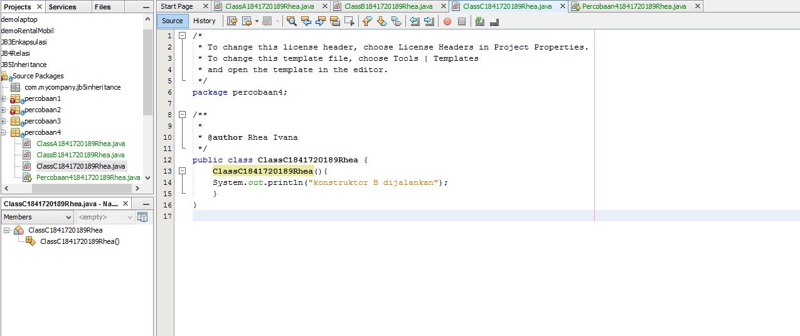

## Laporan Praktikum #6 - Inheritance

## Kompetensi

1.    Memahami konsep dasar inheritance atau pewarisan.

2.    Mampu membuat suatu subclass dari suatu superclass tertentu.

3.    Mampu mengimplementasikan konsep single dan multilevel inheritance.

4.    Mampu membuat objek dari suatusubclass dan melakukan pengaksesan terhadap atribut dan method baik yang dimiliki sendiri atau turunan dari superclass nya.

## Ringkasan Materi

Inheritance atau pewarisan sifat merupakan suatu cara untuk menurunkan suatu class yang lebih umum menjadi suatu class yang lebih spesifik. Inheritance adalah salah satu ciri utama suatu bahasa program yang berorientasi pada objek. Inti dari pewarisan adalah sifat reusable dari konsep object oriented. Setiap subclass akan “mewarisi” sifat dari superclass selama bersifat protected ataupun public.

Dalam inheritance terdapat dua istilah yang sering digunakan. Kelas yang menurunkan disebut kelas dasar (base class/super class), sedangkan kelas yang diturunkan disebut kelas turunan (derived class/sub class/child class) . Di dalam Java untuk mendeklarasikan suatu class sebagai subclass dilakukan dengan cara menambahkan kata kunci extends setelah deklarasi nama class, kemudian diikuti dengan nama parent class-­‐nya. Kata kunci extends tersebut memberitahu kompiler Java bahwa kita ingin melakukan perluasan class. Berikut adalah contoh deklarasi inheritance.

Single inheritance adalah Suatu class yang hanya mempunyai satu parent class. Multilevel inheritance adalah Suatu subclass bisa menjadi superclass bagi class yang lain. 

## Percobaan

### Percobaan 1

Class ClassA1841720189Rhea.java

- [ClassA1841720189Rhea.java](../../src/6_Inheritance/Percobaan1/P1ClassA1841720189Rhea.java)

Class ClassB1841720189Rhea.java

- [ClassB1841720189Rhea.java](../../src/6_Inheritance/Percobaan1/P1ClassB1841720189Rhea.java)

ClassMain Percobaan11841720189Rhea.java

- [Percobaan11841720189Rhea.java](../../src/6_Inheritance/Percobaan1/Percobaan11841720189Rhea.java)

###Pertanyaan Percobaan 1

1.Pada percobaan 1 diatas program yang dijalankan terjadi error, kemudian perbaiki sehingga program tersebut bisa dijalankan dan tidak error!

2.Jelaskan apa penyebab program pada percobaan 1 ketika dijalankan terdapat error!
- Program error terjadi karena kurangnya penambahan extends pada Class ClassB1841720189Rhea.java, sehingga saat program dijalankan akan mengalami error

### Percobaan 2

Class ClassA1841720189Rhea.java

- [ClassA1841720189Rhea.java](../../src/6_Inheritance/Percobaan2/P2ClassA1841720189Rhea.java)

Class ClassB1841720189Rhea.java

- [ClassB1841720189Rhea.java](../../src/6_Inheritance/Percobaan2/P2ClassB1841720189Rhea.java)

ClassMain Percobaan21841720189Rhea.java

- [Percobaan21841720189Rhea.java](../../src/6_Inheritance/Percobaan2/Percobaan21841720189Rhea.java)

## Pertanyaan Percobaan 2

1.Pada percobaan 2 diatas program yang dijalankan terjadi error, kemudian perbaiki sehingga program tersebut bisa dijalankan dan tidak error!

2.Jelaskan apa penyebab program pada percobaan 1 ketika dijalankan terdapat error!

- Karena kurangnya penambahan method Getter pada ClassA1841720189Rhea,ClassB1841720189Rhea,dan kurangnya extends pada ClassB1841720189Rhea. Sehingga ketika program dijalankan akan terjadi eror

### Percobaan 3

Class Bangun1841720189Rhea.java

- [Bangun1841720189Rhea.java](../../src/6_Inheritance/Percobaan3/Bangun1841720189Rhea.java)

Class Tabung1841720189Rhea.java

- [Tabung1841720189Rhea.java](../../src/6_Inheritance/Percobaan3/Tabung1841720189Rhea.java)

ClassMain Percobaan31841720189Rhea.java

- [Percobaan21841720189Rhea.java](../../src/6_Inheritance/Percobaan3/Percobaan31841720189Rhea.java)

## Pertanyaan Percobaan 3

1.Jelaskan fungsi “super” pada potongan program berikut di class Tabung!
- Merujuk/mengakses atribut dari parent class/superclass

2.Jelaskan fungsi “super” dan “this” pada potongan program berikut di class Tabung!
- "super" berfungsi untuk merujuk/mengakses atribut dari parent class/superclass, sedangkan "this" berfungsi untuk merujuk/mengakses atribut dari class itu sendiri

### Percobaan 4

Class ClassA1841720189Rhea.java

- [ClassA1841720189Rhea.java](../../src/6_Inheritance/Percobaan4/P4ClassA1841720189Rhea.java)

Class ClassB1841720189Rhea.java

- [ClassB1841720189Rhea.java](../../src/6_Inheritance/Percobaan4/P4ClassB1841720189Rhea.java)

Class ClassC1841720189Rhea.java

- [ClassC1841720189Rhea.java](../../src/6_Inheritance/Percobaan4/P4ClassC1841720189Rhea.java)

ClassMain Percobaan41841720189Rhea.java

- [Percobaan41841720189Rhea.java](../../src/6_Inheritance/Percobaan4/Percobaan41841720189Rhea.java)

### Pertanyaan Percobaan 4

1.Pada percobaan 4 sebutkan mana class yang termasuk superclass dan subclass, kemudian jelaskan alasannya!

- superclass: ClassA1841720189Rhea dan ClassB1841720189Rhea

- subclass : ClassC1841720189Rhea
- alasan : pertama ClassB1841720189Rhea
merupakan subclass dari ClassA1841720189Rhea, sehingga dalam hal ini ClassA1841720189Rhea adalah superclass dan ClassB1841720189Rhea adalah subclass.

2.Ubahlah isi konstruktor default ClassC seperti berikut:

### Percobaan 5

Class Karyawan1841720189Rhea.java

- [Karyawan1841720189Rhea.java](../../src/6_Inheritance/Percobaan5/Karyawan1841720189Rhea.java)

Class Manager1841720189Rhea.java

- [Manager1841720189Rhea.java](../../src/6_Inheritance/Percobaan6/Manager1841720189Rhea.java)

Class Staff1841720189Rhea.java

- [Staff1841720189Rhea.java](../../src/6_Inheritance/Percobaan5/Staff1841720189Rhea.java)

ClassMain Inheritance11841720189Rhea.java

- [Inheritance11841720189Rhea.java](../../src/6_Inheritance/Percobaan5/Inheritance11841720189Rhea.java)

### Pertanyaan Percobaan 5

1.Sebutkan class mana yang termasuk super class dan sub class dari percobaan 1 diatas!

 - superclass :Karyawan1841720189Rhea

- subclass : Manager1841720189Rhea dan Staff1841720189Rhea

2.Kata kunci apakah yang digunakan untuk menurunkan suatu class ke class yang lain?

- subclass extends superclass

3.Perhatikan kode program pada class Manager, atribut apa saja yang dimiliki oleh class tersebut? Sebutkan atribut mana saja yang diwarisi dari class Karyawan!

- atribut pada class 
Manager1841720189Rhea.java : tunjungan - atribut pada class
Karyawan1841720189Rhea : nama,alamat,jk,umur,gaji

4.Jelaskan kata kunci super pada potongan program dibawah ini yang terdapat pada class Manager!

- Digunakan untuk merujuk/mengakses atribut gaji dari parent class/superclass 
Karyawan1841720189Rhea

5.Program pada percobaan 1 diatas termasuk dalam jenis inheritance apa? Jelaskan alasannya!
 Single Inheritance, karena class 
 Manager1841720189Rhea dan Staff1841720189Rhea hanya mempunyai satu parent class yaitu Karyawan1841720189Rhea

 ### Percobaan 6

Class StaffHarian1841720189Rhea.java

- [StaffHarian1841720189Rhea.java](../../src/6_Inheritance/Percobaan5/StaffHarian1841720189Rhea.java)

Class StaffTetap1841720189Rhea.java

- [StaffTetap1841720189Rhea.java](../../src/6_Inheritance/Percobaan5/StaffTetap1841720189Rhea.java)

ClassMain Inheritance21841720189Rhea.java

- [Inheritance21841720189Rhea.java](../../src/6_Inheritance/Percobaan5/Inheritance21841720189Rhea.java)

### Pertanyaan Percobaan 6
1.Berdasarkan class diatas manakah yang termasuk single inheritance dan mana yang termasuk multilevel inheritance?

- Single Inheritance : 
Karyawan1841720189Rhea,Manager1841720189Rhea,dan Staff1841720189Rhea

- Staff1841720189Rhea
Staff1841720189Rhea,dan
StaffTetap1841720189Rhea

- Multilevel Inheritance :
Karyawan1841720189Rhea,
Staff1841720189Rhea,dan
StaffHarian1841720189Rhea

- Karyawan1841720189Rhea,
Staff1841720189Rhea,dan
StaffTetap1841720189Rhea

2.Perhatikan kode program class StaffTetap dan StaffHarian, atribut apa saja yang dimiliki oleh class tersebut? Sebutkan atribut mana saja yang diwarisi dari class Staff!

- StaffHarian1841720189Rhea:jmlJamKerja
- StaffTetap1841720189Rhea:golongan dan asuransi
- Staff1841720189Rhea: nama,alamat,jk,umur,gaji,lembur,dan potongan 

3.Apakah fungsi potongan program berikut pada class StaffHarian
- Berguna untuk merujuk / memanggil konstruktor berparamter dari superclass

4.Apakah fungsi potongan program berikut pada class StaffHarian

- Berfungsi untuk merujuk/memanggil method
tampilDataRhea dari parent
class/superclass yaitu Staff1841720189Rhea.java

5.Perhatikan kode program dibawah ini yang terdapat pada class StaffTetap

- Karena sudah terdapat super(nama, alamat, jk, umur, gaji, potongan, lembur) 

## Tugas

1.Buatlah sebuah program dengan konsep pewarisan seperti pada class diagram berikut ini. Kemudian buatlah instansiasi objek untuk menampilkan data pada class Mac, Windows dan Pc!.

Class Komputer1841720189Rhea.java

- [Komputer1841720189Rhea](../../src/6_Inheritance/Tugas/Komputer1841720189Rhea.java)

Class Laptop1841720189Rhea.java

- [Laptop1841720189Rhea](../../src/6_Inheritance/Tugas/Laptop1841720189Rhea.java)

Class PC1841720189Rhea.java

- [PC1841720189Rhea](../../src/6_Inheritance/Tugas/PC1841720189Rhea.java)

Class Mac1841720189Rhea.java

- [Mac1841720189Rhea](../../src/6_Inheritance/Tugas/Mac1841720189Rhea.java)

Class Windows1841720189Rhea.java

- [Windows1841720189Rhea](../../src/6_Inheritance/Tugas/Windows1841720189Rhea.java)

Class Main!

- [TugasMain](../../src/6_Inheritance/Tugas/TugasMain.java)
